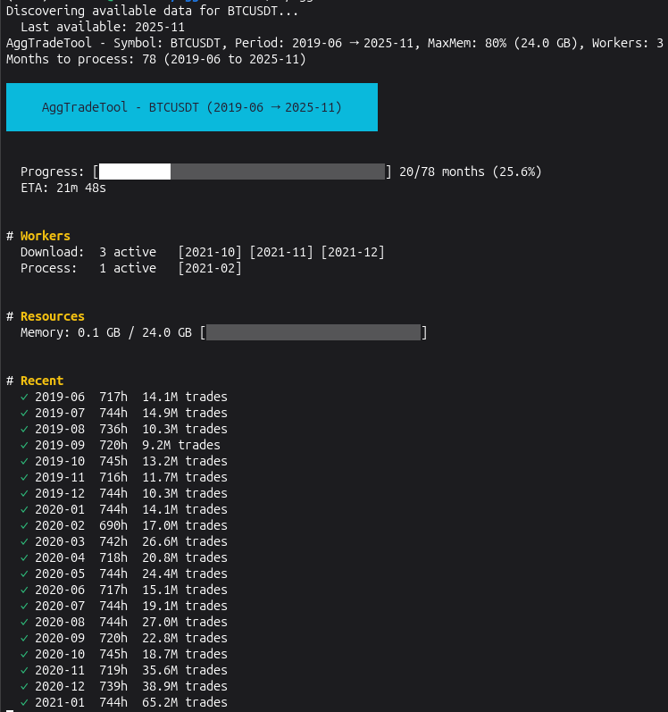

# AggTradesTool

High-performance Binance aggTrades downloader and aggregator designed for neural network training. Processes raw trade data into hourly features with advanced order flow metrics and adaptive whale detection.

## Purpose

This tool prepares historical cryptocurrency trade data for ML model training by:
- Downloading raw aggTrades from Binance Data Vision
- Aggregating millions of trades into clean hourly bars
- Computing order flow features (buy/sell pressure, whale activity)
- Detecting large trades using adaptive rolling percentile thresholds
- Exporting to Parquet format for efficient ML pipeline integration

## Features

| Feature | Description |
|---------|-------------|
| **Streaming Processing** | Memory-efficient parsing of multi-GB CSV files |
| **Adaptive Whale Detection** | Rolling 7-day P99/P99.9 thresholds with bootstrap initialization |
| **Resume Support** | Checkpoint system for interrupted downloads |
| **Parallel Downloads** | Configurable concurrent download workers |
| **Memory Management** | Automatic backpressure based on system RAM |

## Preview



## Output Schema

The tool generates a Parquet file with the following features per hour:

### Volume Metrics
- `buy_vol`, `sell_vol` - Volume in base asset (e.g., BTC)
- `buy_vol_usd`, `sell_vol_usd` - Volume in USD
- `n_trades`, `buy_count`, `sell_count` - Trade counts

### Whale Detection (Adaptive Thresholds)
- `whale_buy_vol_p99`, `whale_sell_vol_p99` - Volume from top 1% trades
- `whale_buy_vol_p999`, `whale_sell_vol_p999` - Volume from top 0.1% trades
- `whale_buy_count_p99`, `whale_sell_count_p99` - Count of whale trades
- `whale_buy_count_p999`, `whale_sell_count_p999` - Count of mega-whale trades

### Intra-Hour Distribution
- `vol_first_30min`, `vol_last_30min` - Volume distribution within the hour

### Price Statistics
- `vwap` - Volume-weighted average price
- `price_std` - Price standard deviation
- `max_trade_size` - Largest single trade in the hour

## Installation

```bash
git clone https://github.com/clemsix6/AggTradesTool.git
cd AggTradesTool
go build -o aggtrades ./cmd/aggtrades
```

## Usage

### Basic Usage
```bash
# Download all available BTCUSDT data
./aggtrades

# Specify date range
./aggtrades --start 2020-01 --end 2024-12

# Different trading pair
./aggtrades --symbol ETHUSDT --start 2021-01 --end 2024-12
```

### Options
```
--symbol            Trading pair (default: BTCUSDT)
--start             Start month YYYY-MM (default: first available)
--end               End month YYYY-MM (default: last available)
--max-memory        Maximum RAM usage percentage (default: 80)
--download-workers  Number of parallel downloads (default: 3)
--no-tui            Disable terminal UI, use plain logs
```

## Data Processing Pipeline

```
Binance Data Vision (ZIP)
         |
         v
    Download & Extract
         |
         v
    Stream Parse CSV --------> Reservoir Sampling
         |                     (for percentile calculation)
         v
    Classify Trades <--------- Rolling P99/P99.9 Thresholds
         |
         v
    Hourly Aggregation
         |
         v
    Checkpoint (JSON) -------> Resume on restart
         |
         v
    Parquet Output
```

## Whale Detection Algorithm

The tool uses adaptive thresholds rather than fixed values:

1. **Bootstrap Phase**: First 50,000 trades establish initial P99/P99.9 thresholds
2. **Rolling Window**: 7-day sliding window of sampled trade sizes
3. **Reservoir Sampling**: 10,000 samples per day for memory efficiency
4. **Per-Trade Classification**: Each trade compared against thresholds from previous 7 days

This ensures whale detection adapts to:
- Different trading pairs (BTC vs altcoins)
- Market regime changes over time
- Varying liquidity conditions

## For ML Training

### Loading the Data
```python
import pandas as pd

df = pd.read_parquet('aggtrades_BTCUSDT_2017-08_2024-12.parquet')
df['time'] = pd.to_datetime(df['time'], unit='ms')
df.set_index('time', inplace=True)
```

### Feature Engineering Examples
```python
# Net order flow
df['net_volume'] = df['buy_vol'] - df['sell_vol']
df['net_whale_vol'] = df['whale_buy_vol_p99'] - df['whale_sell_vol_p99']

# Whale dominance ratio
df['whale_ratio'] = (df['whale_buy_vol_p99'] + df['whale_sell_vol_p99']) / (df['buy_vol'] + df['sell_vol'])

# Intra-hour momentum
df['hour_momentum'] = df['vol_last_30min'] / (df['vol_first_30min'] + 1e-8)

# Rolling features
df['vol_zscore'] = (df['buy_vol'] + df['sell_vol'] - df['buy_vol'].rolling(24).mean()) / df['buy_vol'].rolling(24).std()
```

### Data Quality Notes
- First 168 hours (7 days) are trimmed as warmup period
- Small gaps (<=6 hours) are linearly interpolated
- Large gaps filled with zeros (identifiable via low `n_trades`)
- No lookahead bias in whale classification

## License

MIT
